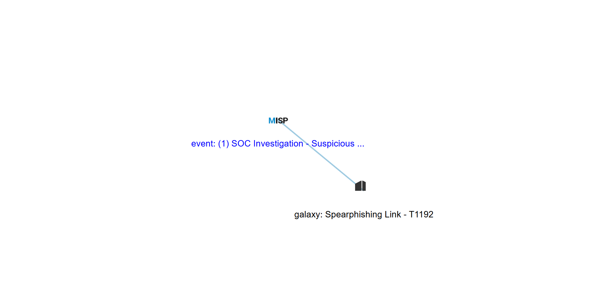
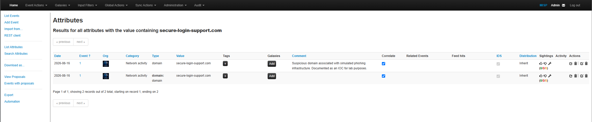
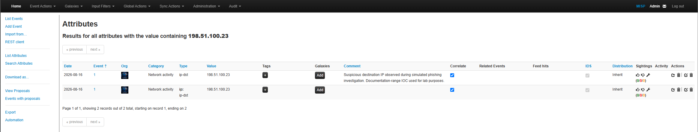
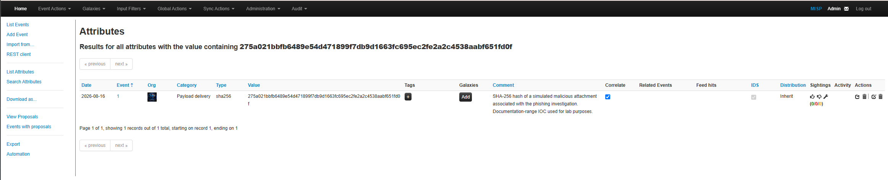
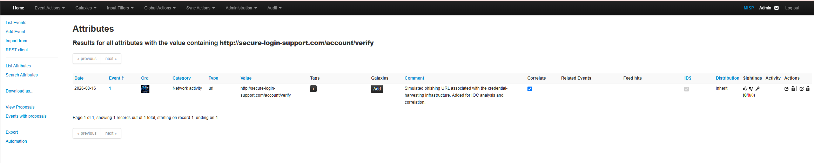

# MISP Phishing Threat Intelligence Investigation


> A hands-on cyber threat intelligence investigation demonstrating phishing IOC analysis, MISP object modeling, indicator correlation, IOC validation, and MITRE ATT&CK mapping.

---

## Project Overview

This project documents a simulated phishing threat intelligence investigation conducted using MISP (Malware Information Sharing Platform).

The investigation demonstrates how a SOC or Cyber Threat Intelligence (CTI) analyst can transform isolated technical indicators into structured, correlated, and actionable threat intelligence.

The workflow includes:

- Identification and documentation of phishing-related indicators of compromise (IOCs)
- Structured IOC management within MISP
- Domain-to-IP relationship modeling using MISP objects
- IOC correlation and validation
- MITRE ATT&CK mapping
- Analyst assessment and investigation documentation

> **Lab Safety Notice:** All indicators used in this project are simulated or documentation-range artifacts created exclusively for defensive cybersecurity training. No live malicious infrastructure was used.

---

## Investigation Scenario

The simulated investigation centered on phishing infrastructure designed to represent an account-verification credential-harvesting campaign.

Four primary indicators were analyzed:

| IOC Type | Indicator | MISP Type |
|---|---|---|
| Domain | `secure-login-support.com` | `domain` |
| Destination IP | `198.51.100.23` | `ip-dst` |
| URL | `http://secure-login-support.com/account/verify` | `url` |
| File Hash | `275a021bbfb6489e54d471899f7db9d1663fc695ec2fe2a2c4538aabf651fd0f` | `sha256` |

The investigation was maintained as:

```text
Event:        SOC Investigation - Suspicious Phishing Infrastructure
Threat Level: Medium
Analysis:     Completed
```

---

## Investigation Workflow

```text
Phishing Scenario
       |
       v
IOC Identification
       |
       +--> Domain
       +--> Destination IP
       +--> URL
       +--> SHA-256
       |
       v
MISP Event Creation
       |
       v
IOC Classification
       |
       v
Correlation Enabled
       |
       v
domain-ip Object Modeling
       |
       v
MITRE ATT&CK Mapping
       |
       v
IOC Search & Validation
       |
       v
Analyst Assessment
```

---

## MISP Threat Intelligence Model

Rather than maintaining only a flat IOC list, the investigation preserved relationships between the observed artifacts.

```text
                 Phishing Activity
                        |
          +-------------+-------------+
          |             |             |
          v             v             v
       Domain          URL         SHA-256
          |
          v
   Destination IP
```

The domain and destination IP were additionally modeled using a structured MISP `domain-ip` object.

---

## MITRE ATT&CK Mapping

The phishing behavior was associated with the MISP Enterprise ATT&CK Galaxy entry:

**Spearphishing Link — T1192**

The MISP environment used for this lab displayed the legacy `T1192` identifier. The project preserves the identifier shown by the lab environment rather than modifying historical evidence.

### ATT&CK Correlation Evidence



The graph demonstrates the relationship between the MISP investigation event and the selected Spearphishing Link ATT&CK Galaxy cluster.

---

## IOC Validation

Each primary indicator was searched independently after being entered into MISP.

| Indicator Type | Search Result | Status |
|---|---:|---|
| Domain | 2 records | ✅ Validated |
| Destination IP | 2 records | ✅ Validated |
| SHA-256 | 1 record | ✅ Validated |
| URL | 1 record | ✅ Validated |

The domain and destination IP return two records because each exists both as a standalone attribute and as a component of the structured `domain-ip` object.

### Domain Validation



### Destination IP Validation



### SHA-256 Validation



### URL Validation



---

## Investigation Documentation

Detailed analyst documentation is available in the `docs/` directory:

| Document | Description |
|---|---|
| [01 — Investigation Overview](docs/01-investigation-overview.md) | Scenario, scope, objectives, methodology, and intelligence model |
| [02 — IOC Analysis](docs/02-ioc-analysis.md) | Domain, destination IP, URL, and SHA-256 analysis |
| [03 — MISP Object Modeling](docs/03-misp-object-modeling.md) | Structured domain-to-IP relationship modeling |
| [04 — MITRE ATT&CK Mapping](docs/04-mitre-attack-mapping.md) | ATT&CK Galaxy association and behavioral context |
| [05 — IOC Validation](docs/05-ioc-validation.md) | IOC search, validation, and analyst pivot workflow |
| [06 — Analyst Conclusion](docs/06-analyst-conclusion.md) | Findings, limitations, defensive recommendations, and final assessment |

---

## Repository Structure

```text
misp-phishing-threat-intelligence-lab/
|
├── README.md
├── LICENSE
|
├── docs/
│   ├── 01-investigation-overview.md
│   ├── 02-ioc-analysis.md
│   ├── 03-misp-object-modeling.md
│   ├── 04-mitre-attack-mapping.md
│   ├── 05-ioc-validation.md
│   └── 06-analyst-conclusion.md
|
└── evidence/
    └── screenshots/
        ├── misp-correlation-graph-spearphishing-link.png
        ├── misp-ioc-domain-search-results.png
        ├── misp-ioc-ip-search-results.png
        ├── misp-ioc-sha256-search-results.png
        └── misp-ioc-url-search-results.png
```

---

## Skills Demonstrated

This project demonstrates practical experience with:

- MISP threat-intelligence operations
- SOC investigation workflows
- Cyber Threat Intelligence fundamentals
- IOC creation and management
- Domain and IP analysis
- URL analysis
- SHA-256 file indicators
- MISP attribute classification
- IOC correlation
- MISP object modeling
- Domain-to-IP relationship analysis
- MISP Galaxies
- MITRE ATT&CK mapping
- IOC search and validation
- Threat-intelligence pivoting
- Phishing infrastructure analysis
- Analyst reporting and documentation

---

## SOC Analyst Application

A similar workflow can support operational SOC investigations:

```text
SIEM / EDR / Email Alert
          |
          v
      Extract IOC
          |
          v
       Search MISP
          |
     +----+----+
     |         |
 No Match     Match
     |         |
     v         v
 Enrich     Review Event
               |
               v
         Related Indicators
               |
               v
         Hunt Telemetry
               |
               v
        Scope Incident
               |
               v
       Defensive Action
```

Threat intelligence therefore becomes more than an IOC repository—it provides context analysts can use to pivot between alerts, infrastructure, related indicators, and defensive telemetry.

---

## Key Takeaways

This investigation demonstrated that useful threat intelligence requires more than collecting technical indicators.

Indicators become more operationally valuable when they are:

1. Correctly classified
2. Given investigative context
3. Structured into meaningful relationships
4. Available for correlation
5. Mapped to adversary behavior
6. Searchable for future investigations
7. Documented with analyst findings

MISP provides a platform for transforming individual artifacts into reusable threat intelligence that can support SOC investigations, threat hunting, detection engineering, and incident response.

---

## Project Status

**Investigation Complete ✅**

```text
IOC Collection       Complete
MISP Classification  Complete
Object Modeling      Complete
IOC Correlation      Complete
ATT&CK Mapping       Complete
IOC Validation       Complete
Analyst Assessment   Complete
Documentation        Complete
```

---

## Disclaimer

This repository was created exclusively for cybersecurity education, defensive-security training, and portfolio development.

All indicators and infrastructure represented in this project are simulated or documentation-range artifacts. No real organization, production environment, user, or malicious infrastructure was targeted.

---

## Author

**Anik Nohan**

Cybersecurity | SOC Analysis | Blue Team | Threat Intelligence
