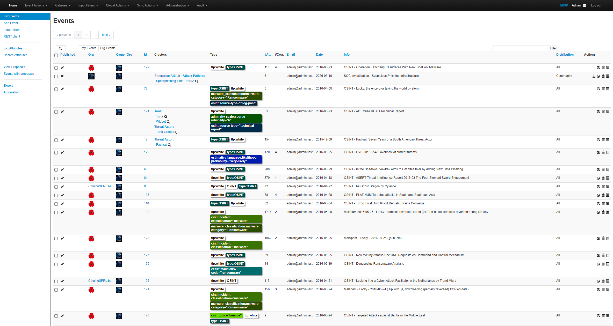
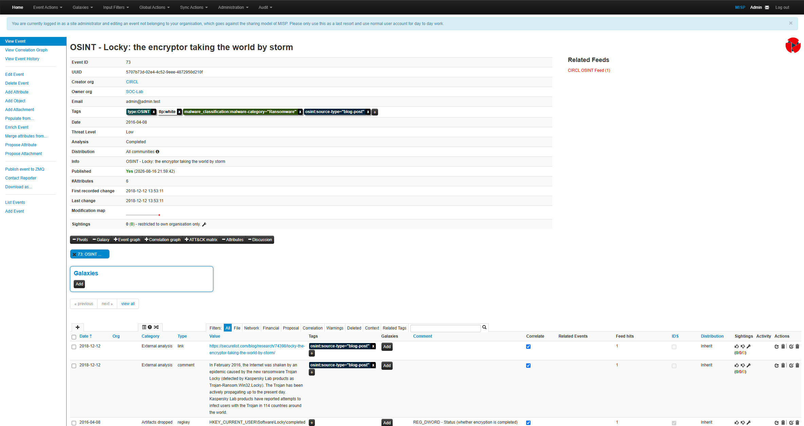
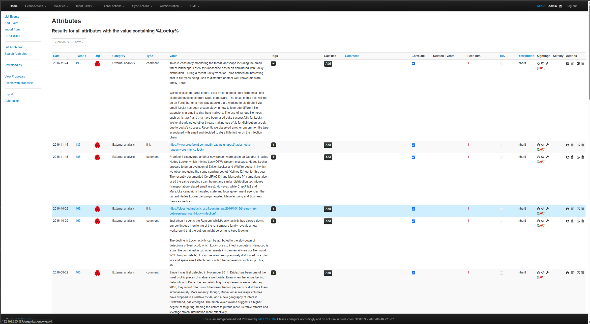
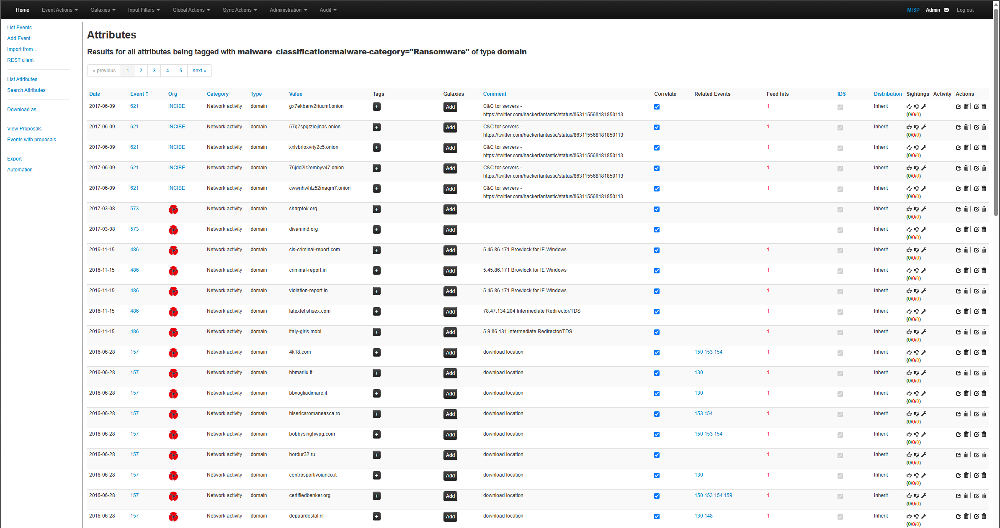
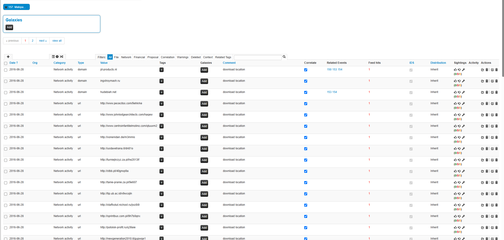
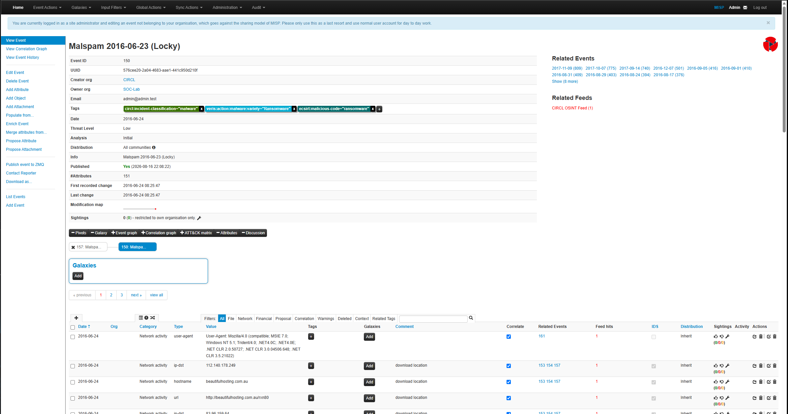
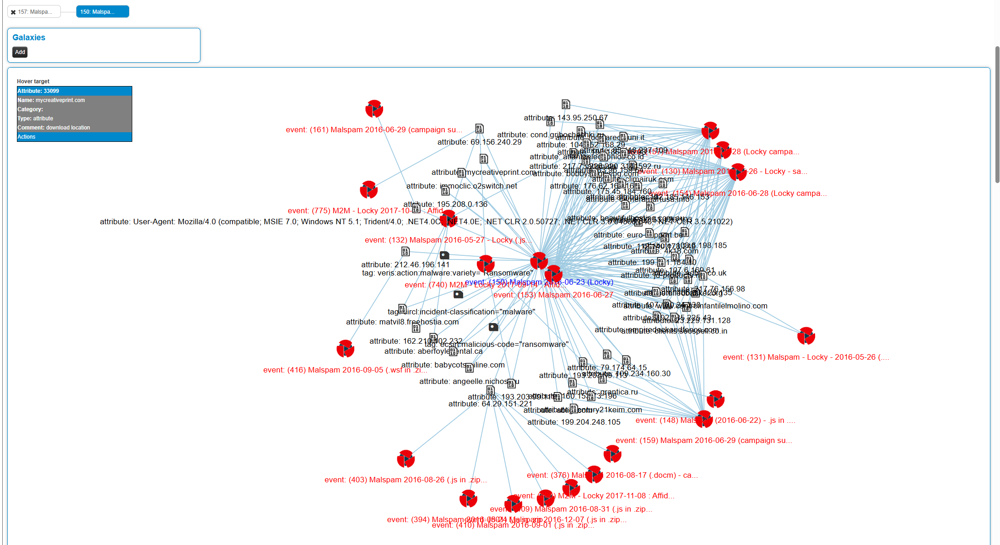
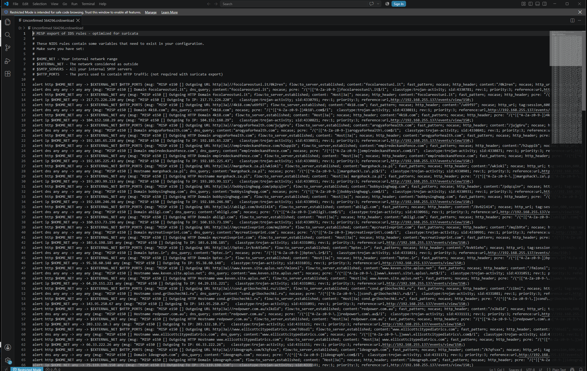
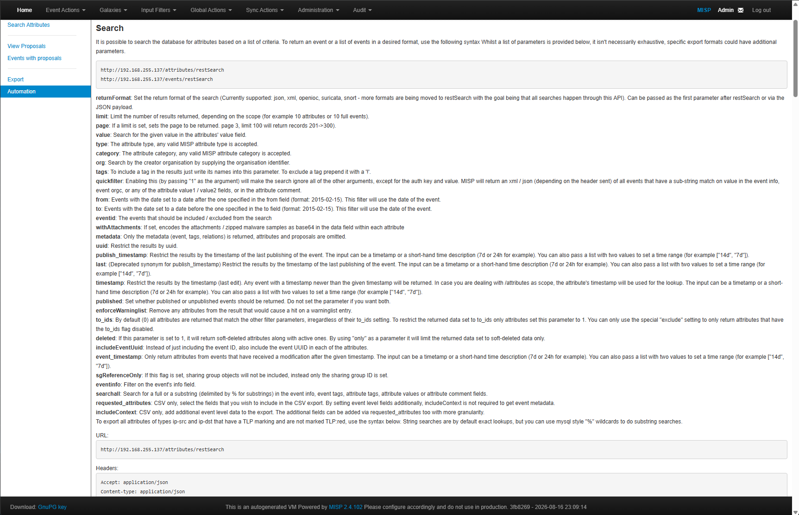

# MISP Phishing Threat Intelligence Investigation


> A hands-on cyber threat intelligence investigation demonstrating phishing IOC analysis, MISP object modeling, indicator correlation, IOC validation, and MITRE ATT&CK mapping.

---

## Project Overview

This project documents a simulated phishing threat intelligence investigation conducted using MISP (Malware Information Sharing Platform).

The investigation demonstrates how a SOC or Cyber Threat Intelligence (CTI) analyst can transform isolated technical indicators into structured, correlated, and actionable threat intelligence.

The workflow includes:

- Identification and documentation of phishing-related indicators of compromise (IOCs)
- Structured IOC management within MISP
- Domain-to-IP relationship modeling using MISP objects
- IOC correlation and validation
- MITRE ATT&CK mapping
- Analyst assessment and investigation documentation

> **Lab Safety Notice:** All indicators used in this project are simulated or documentation-range artifacts created exclusively for defensive cybersecurity training. No live malicious infrastructure was used.

---
## Investigation Documentation

Detailed analysis and supporting documentation are organized into the following investigation phases:

| Phase | Documentation | Focus |
|---|---|---|
| 01 | [Investigation Overview](docs/01-investigation-overview.md) | Scenario, objectives, scope, and investigation methodology |
| 02 | [IOC Analysis](docs/02-ioc-analysis.md) | Analysis of domain, IP address, URL, and SHA-256 indicators |
| 03 | [MISP Object Modeling](docs/03-misp-object-modeling.md) | Structured domain-to-IP relationship modeling in MISP |
| 04 | [MITRE ATT&CK Mapping](docs/04-mitre-attack-mapping.md) | Mapping phishing activity to Spearphishing Link (T1192) |
| 05 | [IOC Validation](docs/05-ioc-validation.md) | MISP searches used to validate and correlate recorded indicators |
| 06 | [Analyst Conclusion](docs/06-analyst-conclusion.md) | Final assessment, findings, and defensive recommendations |
| 07 | [MISP Threat Correlation](docs/07-misp-threat-correlation.md) | Locky ransomware analysis, IOC correlation, event pivoting, detection exports, and REST API automation |

### Investigation Workflow

`Phishing Scenario` → `IOC Identification` → `MISP Event Creation` → `Object Modeling` → `IOC Correlation` → `MITRE ATT&CK Mapping` → `IOC Validation` → `Analyst Assessment`

---

## Skills Demonstrated

This project demonstrates practical skills applicable to SOC, Cyber Threat Intelligence (CTI), and Blue Team operations:

| Competency | Practical Application |
|---|---|
| Threat Intelligence Analysis | Analyzed and documented phishing-related indicators within a structured intelligence workflow |
| Indicator of Compromise (IOC) Analysis | Investigated domain, destination IP, URL, and SHA-256 indicators |
| MISP Event Management | Created and maintained a structured MISP investigation event |
| MISP Object Modeling | Modeled the relationship between phishing infrastructure using a domain-to-IP object |
| IOC Correlation | Enabled correlation to identify relationships and potential indicator reuse |
| MITRE ATT&CK Mapping | Mapped the simulated phishing activity to Spearphishing Link (T1192) |
| Threat Infrastructure Analysis | Connected domain, IP, URL, and file-hash artifacts within a unified investigation |
| IOC Validation | Queried recorded indicators to verify their presence and investigative context |
| Analyst Documentation | Produced structured investigation notes, evidence, findings, and defensive recommendations |

### Tools & Frameworks

- **MISP** — Threat intelligence management, IOC storage, object modeling, and correlation
- **MITRE ATT&CK** — Adversary technique classification and investigation context
- **GitHub** — Technical documentation, evidence management, and portfolio presentation

---


## Investigation Scenario

The simulated investigation centered on phishing infrastructure designed to represent an account-verification credential-harvesting campaign.

Four primary indicators were analyzed:

| IOC Type | Indicator | MISP Type |
|---|---|---|
| Domain | `secure-login-support.com` | `domain` |
| Destination IP | `198.51.100.23` | `ip-dst` |
| URL | `http://secure-login-support.com/account/verify` | `url` |
| File Hash | `275a021bbfb6489e54d471899f7db9d1663fc695ec2fe2a2c4538aabf651fd0f` | `sha256` |

The investigation was maintained as:

```text
Event:        SOC Investigation - Suspicious Phishing Infrastructure
Threat Level: Medium
Analysis:     Completed
```

---

## Investigation Workflow

```text
Phishing Scenario
       |
       v
IOC Identification
       |
       +--> Domain
       +--> Destination IP
       +--> URL
       +--> SHA-256
       |
       v
MISP Event Creation
       |
       v
IOC Classification
       |
       v
Correlation Enabled
       |
       v
domain-ip Object Modeling
       |
       v
MITRE ATT&CK Mapping
       |
       v
IOC Search & Validation
       |
       v
Analyst Assessment
```

---

## MISP Threat Intelligence Model

Rather than maintaining only a flat IOC list, the investigation preserved relationships between the observed artifacts.

```text
                 Phishing Activity
                        |
          +-------------+-------------+
          |             |             |
          v             v             v
       Domain          URL         SHA-256
          |
          v
   Destination IP
```

The domain and destination IP were additionally modeled using a structured MISP `domain-ip` object.

---

## MITRE ATT&CK Mapping

The phishing behavior was associated with the MISP Enterprise ATT&CK Galaxy entry:

**Spearphishing Link — T1192**

The MISP environment used for this lab displayed the legacy `T1192` identifier. The project preserves the identifier shown by the lab environment rather than modifying historical evidence.
---

## IOC Validation

Each primary indicator was searched independently after being entered into MISP.

| Indicator Type | Search Result | Status |
|---|---:|---|
| Domain | 2 records | ✅ Validated |
| Destination IP | 2 records | ✅ Validated |
| SHA-256 | 1 record | ✅ Validated |
| URL | 1 record | ✅ Validated |

The domain and destination IP return two records because each exists both as a standalone attribute and as a component of the structured `domain-ip` object.

## Investigation Evidence

The following evidence captures key stages of the MISP investigation, including ATT&CK mapping and IOC validation.

### MITRE ATT&CK Correlation


*MISP correlation graph associating the investigation with the MITRE ATT&CK Spearphishing Link technique (T1192).*

### IOC Validation Evidence

#### Domain


*Validation of the simulated phishing domain within the MISP attribute dataset.*

#### Destination IP


*Validation of the documentation-range destination IP associated with the simulated phishing infrastructure.*

#### SHA-256


*Validation of the SHA-256 indicator representing the simulated malicious attachment.*

#### URL


*Validation of the simulated credential-harvesting URL recorded during the investigation.*

> **Evidence Note:** Indicators shown in these screenshots are simulated or documentation-range artifacts used exclusively for defensive cybersecurity training.

---


## Investigation Documentation

Detailed analyst documentation is available in the `docs/` directory:

| Document | Description |
|---|---|
| [01 — Investigation Overview](docs/01-investigation-overview.md) | Scenario, scope, objectives, methodology, and intelligence model |
| [02 — IOC Analysis](docs/02-ioc-analysis.md) | Domain, destination IP, URL, and SHA-256 analysis |
| [03 — MISP Object Modeling](docs/03-misp-object-modeling.md) | Structured domain-to-IP relationship modeling |
| [04 — MITRE ATT&CK Mapping](docs/04-mitre-attack-mapping.md) | ATT&CK Galaxy association and behavioral context |
| [05 — IOC Validation](docs/05-ioc-validation.md) | IOC search, validation, and analyst pivot workflow |
| [06 — Analyst Conclusion](docs/06-analyst-conclusion.md) | Findings, limitations, defensive recommendations, and final assessment |
| [07 — MISP Threat Correlation](docs/07-misp-threat-correlation.md) | Locky ransomware investigation, IOC correlation, campaign pivoting, detection exports, and automation |
---

## Repository Structure

```text
misp-phishing-threat-intelligence-lab/
│
├── README.md
├── LICENSE
│
├── docs/
│   ├── 01-investigation-overview.md
│   ├── 02-ioc-analysis.md
│   ├── 03-misp-object-modeling.md
│   ├── 04-mitre-attack-mapping.md
│   ├── 05-ioc-validation.md
│   ├── 06-analyst-conclusion.md
│   └── 07-misp-threat-correlation.md
│
└── evidence/
    └── screenshots/
        ├── 01-misp-baseurl-configuration-verification.png
        ├── 02-misp-soc-lab-organization-configuration.png
        ├── 03-misp-user-organization-management.png
        ├── 04-misp-threat-feeds-enabled.png
        ├── 05-misp-background-workers-started.png
        ├── 06-misp-osint-threat-feed-ingestion-results.png
        ├── 07-misp-locky-ransomware-event.png
        ├── 08-misp-locky-event-iocs.png
        ├── 09-misp-locky-correlation-graph.png
        ├── 10-misp-locky-attack-matrix.png
        ├── 11-misp-locky-correlation-graph.png
        ├── 12-misp-locky-attribute-search.png
        ├── 13-ransomware-domain-ioc-search.png
        ├── 14-ransomware-ip-ioc-search.png
        ├── 15-ransomware-sha256-ioc-search.png
        ├── 16-ransomware-event-correlation.png
        ├── 17-misp-correlated-event-pivot.png
        ├── 18-misp-locky-correlation-graph.png
        ├── 19-misp-ransomware-ioc-export-options.png
        ├── 20-misp-suricata-detection-rule-export.png
        ├── 21-misp-json-threat-intelligence-export.png
        ├── 22-misp-rest-api-automation-interface.png
        └── 23-misp-threat-intelligence-dashboard.png
```

---

## SOC Analyst Application

The threat-intelligence workflow demonstrated in this lab can be integrated into operational SOC investigations. Analysts can extract indicators from SIEM, EDR, or email-security alerts and pivot into MISP to identify known infrastructure, related indicators, and additional investigative context.

```text
SIEM / EDR / Email Alert
          |
          v
      Extract IOC
          |
          v
       Search MISP
          |
     +----+----+
     |         |
 No Match     Match
     |         |
     v         v
 Enrich     Review Event
               |
               v
         Related Indicators
               |
               v
         Hunt Telemetry
               |
               v
        Scope Incident
               |
               v
       Defensive Action
```

This workflow demonstrates how threat intelligence can support alert enrichment and incident scoping rather than functioning solely as an IOC repository. By correlating observed indicators with existing intelligence, analysts can pivot across related infrastructure, identify additional artifacts, hunt for associated activity in security telemetry, and make more informed defensive decisions.

---

## Advanced MISP Threat Intelligence & Correlation Analysis

Following the initial phishing IOC investigation, the lab was expanded into a broader threat-intelligence workflow using **MISP (Malware Information Sharing Platform)**.

The objective was to move beyond manually documenting indicators and demonstrate how a SOC analyst can ingest external threat intelligence, investigate ransomware activity, correlate indicators across events, pivot into related campaigns, and operationalize intelligence for defensive monitoring.

### Threat Intelligence Workflow

The investigation followed the following workflow:

**OSINT Threat Feeds → MISP Events → IOC Analysis → Threat Hunting → Correlation → Event Pivoting → Campaign Analysis → Detection Engineering → Automation**

Key activities included:

- Configuring and validating the MISP lab environment
- Managing organizations and users
- Enabling external OSINT threat-intelligence feeds
- Starting MISP background workers
- Ingesting external threat-intelligence events
- Investigating Locky ransomware intelligence
- Searching globally for ransomware-related IOCs
- Hunting for malicious domains, IP addresses, and SHA-256 hashes
- Correlating indicators across multiple MISP events
- Pivoting between related Locky malspam campaigns
- Visualizing threat relationships using MISP correlation graphs
- Reviewing MITRE ATT&CK context
- Exporting threat intelligence in machine-readable JSON
- Generating Suricata IDS detection rules from MISP intelligence
- Reviewing MISP REST API and automation capabilities

---

### OSINT Threat Intelligence Ingestion

External OSINT feeds were enabled and processed through MISP background workers, populating the platform with additional threat-intelligence events.



This transformed the lab from a manually created phishing investigation into a larger threat-intelligence environment containing malware, ransomware, threat-actor, and campaign intelligence.

---

### Locky Ransomware Investigation

An imported **Locky ransomware** intelligence event was selected for deeper analysis.



The event contained structured threat context including malware classification, OSINT source information, TLP markings, and observable attributes.

MISP's global attribute search was then used to identify additional Locky-related intelligence across the repository.



This demonstrated how an analyst can pivot from a single threat-intelligence event into historical intelligence associated with the same malware family.

---

### IOC Threat Hunting

Ransomware-tagged intelligence was filtered by IOC type to identify actionable indicators including:

- Domains
- Destination IP addresses
- SHA-256 file hashes



These indicators could support DNS investigations, SIEM searches, firewall analysis, endpoint threat hunting, alert enrichment, and incident scoping.

---

### Threat Correlation and Event Pivoting

MISP automatically identified shared indicators across multiple ransomware-related events.



A shared IOC was then used to pivot into a related **Locky malspam event**, exposing additional malicious infrastructure and event relationships.



This demonstrates a practical CTI investigation pattern:

**IOC → Correlation → Related Event → Additional IOCs → Broader Campaign Context**

---

### Locky Campaign Correlation

MISP's correlation graph was used to visualize relationships between the investigated Locky event, shared indicators, and related malspam campaigns.



Graph-based analysis exposed relationships that are difficult to identify when reviewing individual IOC tables and demonstrated how shared infrastructure can connect multiple threat-intelligence events.

---

### Detection Engineering — Suricata Export

Threat intelligence from the investigated ransomware event was exported as **Suricata IDS detection rules**.



MISP translated IDS-enabled indicators into network detection signatures covering observables such as malicious IP addresses, domains, hostnames, and URLs.

This demonstrates the operational workflow:

**Threat Intelligence → IOC → Detection Rule → Network Monitoring**

---

### Threat Intelligence Automation

The investigated event was exported in structured MISP JSON format for machine-readable consumption.

MISP's REST API and automation functionality was also reviewed to understand how threat-intelligence searches can be incorporated into automated security workflows.



Potential integration targets include:

- SIEM platforms
- SOAR workflows
- Threat-hunting scripts
- Detection pipelines
- IOC enrichment systems
- Network security monitoring
- Other CTI platforms

> **Security Note:** Authentication credentials and API keys are intentionally excluded from all published evidence.

---

### SOC Analyst Takeaways

This expanded MISP investigation demonstrates several skills relevant to SOC, Blue Team, and threat-intelligence roles:

| Skill | Demonstrated Activity |
|---|---|
| Threat Intelligence | Ingested and analyzed external OSINT intelligence |
| IOC Analysis | Investigated domains, IP addresses, hashes, URLs, and host artifacts |
| Threat Hunting | Queried MISP globally for ransomware-related indicators |
| Malware Intelligence | Investigated Locky ransomware activity |
| IOC Correlation | Identified shared indicators across threat events |
| Investigation Pivoting | Followed correlations into related Locky campaigns |
| Threat Visualization | Analyzed MISP correlation graphs |
| MITRE ATT&CK | Reviewed ATT&CK context and avoided unsupported mappings |
| Detection Engineering | Generated Suricata IDS rules from threat intelligence |
| Data Integration | Exported structured MISP JSON intelligence |
| SOC Automation | Reviewed REST API-based threat-intelligence retrieval |

### Investigation Documentation

Detailed methodology, screenshots, analyst observations, and findings are available in:

[`docs/07-misp-threat-correlation.md`](docs/07-misp-threat-correlation.md)

The complete investigation evidence is maintained under:

[`evidence/screenshots/`](evidence/screenshots/)

## Key Takeaways

This investigation demonstrated that effective threat intelligence requires more than collecting technical indicators. Individual IOCs become significantly more valuable when they are enriched with context, structured into relationships, correlated with other intelligence, and mapped to adversary behavior.

Key analytical lessons from the investigation include:

1. **Classification provides structure** — correctly typed domain, IP, URL, and file-hash attributes improve searching, correlation, and downstream analysis.
2. **Context increases intelligence value** — analyst comments and event metadata explain why an indicator matters to the investigation.
3. **Relationships reveal infrastructure** — MISP objects preserve connections between related artifacts, such as the relationship between a domain and its destination IP.
4. **Correlation supports investigative pivoting** — searchable indicators allow analysts to identify related intelligence and pivot across potentially connected activity.
5. **MITRE ATT&CK adds behavioral context** — mapping the phishing activity to Spearphishing Link (T1192, as represented in the lab environment) connects technical indicators with adversary behavior.
6. **Validation improves investigative confidence** — independently searching recorded indicators verifies that the intelligence was successfully stored and remains available for future analysis.
7. **Documentation makes intelligence reusable** — structured analyst findings allow investigation results to support future SOC investigations, threat hunting, detection engineering, and incident response.

Together, these practices transform isolated technical artifacts into structured and reusable cyber threat intelligence.

---

## Project Status

**Investigation Complete ✅**

| Investigation Phase | Status |
|---|---|
| IOC Collection | ✅ Complete |
| MISP Classification | ✅ Complete |
| Object Modeling | ✅ Complete |
| IOC Correlation | ✅ Complete |
| MITRE ATT&CK Mapping | ✅ Complete |
| IOC Validation | ✅ Complete |
| Analyst Assessment | ✅ Complete |
| Documentation | ✅ Complete |

---


## Author

**Anik Nohan**

This hands-on MISP Phishing Threat Intelligence Investigation was completed to demonstrate practical skills in:

- Cyber Threat Intelligence (CTI) analysis
- Phishing IOC investigation
- MISP event and attribute management
- IOC classification and validation
- MISP object modeling
- Threat infrastructure analysis
- IOC correlation and investigative pivoting
- OSINT threat intelligence ingestion
- Ransomware threat hunting
- MITRE ATT&CK mapping
- Threat relationship visualization
- Suricata detection-rule generation
- MISP JSON intelligence export
- REST API and security automation concepts
- SOC and CTI investigation documentation

### Tools & Frameworks

`MISP` • `MITRE ATT&CK` • `Suricata` • `OSINT Threat Feeds` • `MISP REST API` • `GitHub`

---

## Disclaimer

This repository was created exclusively for cybersecurity education, defensive-security training, and portfolio development.

All indicators and infrastructure represented in this project are simulated or documentation-range artifacts. No real organization, production environment, user, or malicious infrastructure was targeted.

---
