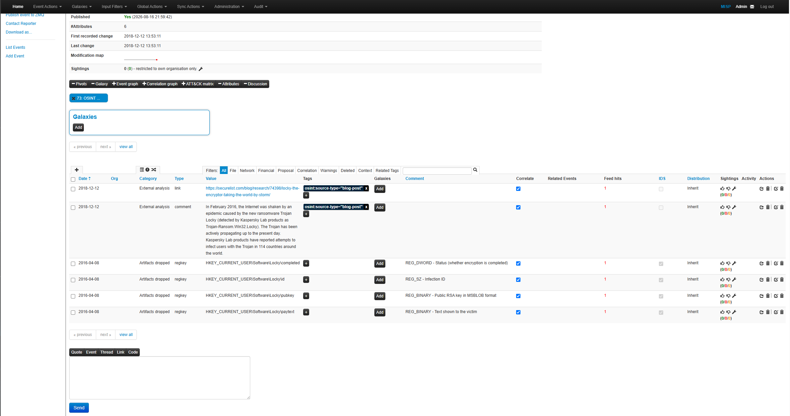
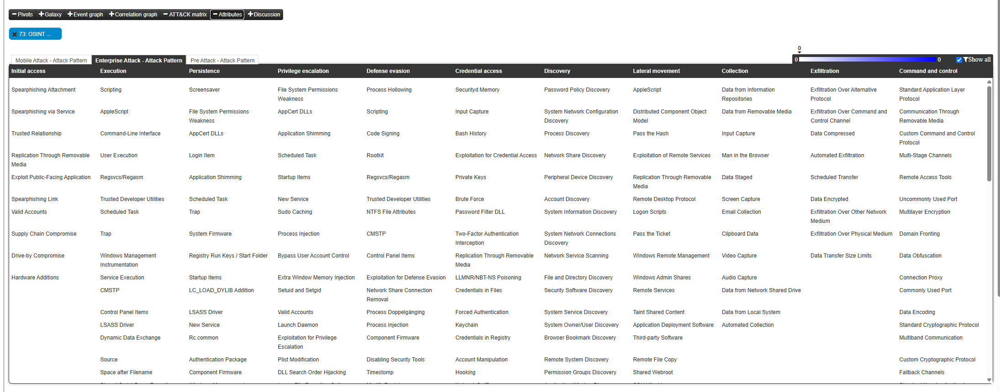
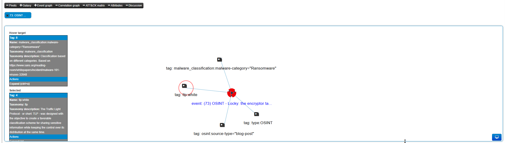
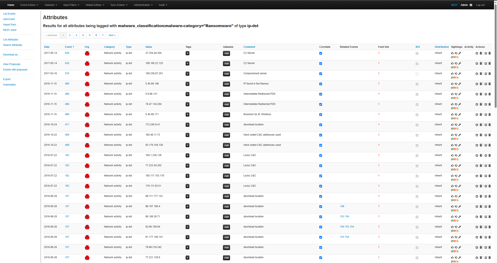
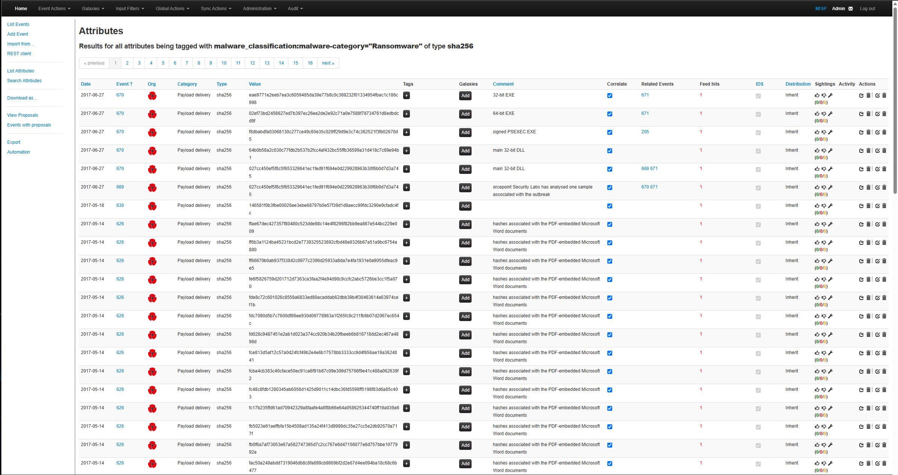
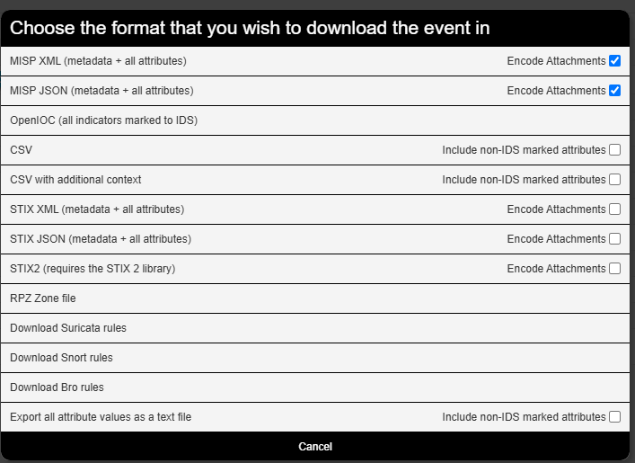
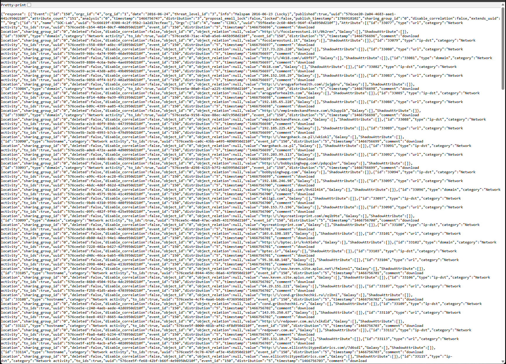
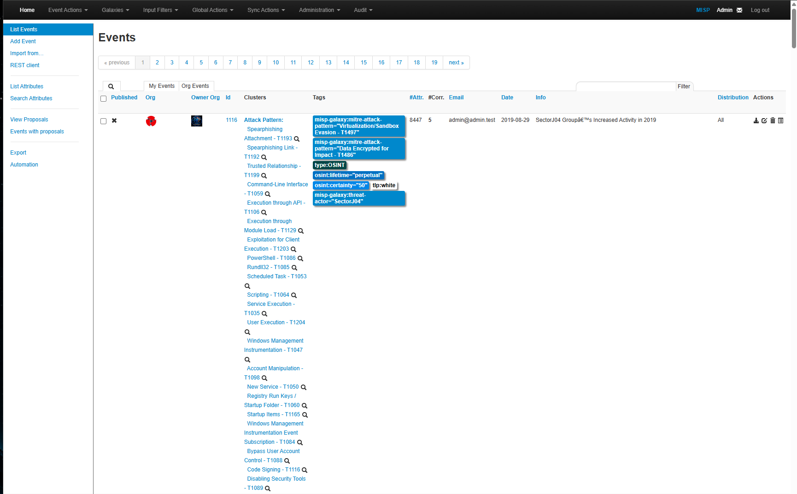

# MISP Threat Correlation and Operationalization

## Overview

This phase of the lab expanded the investigation from individual indicators of compromise (IOCs) into broader cyber threat intelligence analysis using MISP.

The workflow focused on investigating Locky ransomware intelligence, identifying related indicators across multiple events, analyzing event correlations, pivoting into associated campaigns, and operationalizing threat intelligence through detection-rule and machine-readable exports.

The investigation demonstrates a practical SOC/CTI workflow:

**Threat Feed → Event Analysis → IOC Search → Correlation → Event Pivot → Campaign Analysis → Detection Export → Automation**

---

## 1. Locky Ransomware Intelligence

After ingesting OSINT threat feeds into MISP, a Locky ransomware event was selected for deeper analysis.

The event contained structured threat-intelligence metadata including ransomware classification, OSINT source information, TLP markings, and observable attributes.

### Analyst Observation

The event demonstrates how MISP combines indicators with contextual information rather than storing IOCs as isolated values.

Threat classification, source information, distribution controls, tags, and attributes provide analysts with additional context when determining how intelligence should be investigated or operationalized.

---

## 2. Locky Event Indicators

The event attributes were reviewed to identify available Locky-related artifacts and supporting intelligence.

The attributes included external-analysis references and Windows registry artifacts associated with Locky activity.

### Analyst Observation

Host-based artifacts such as registry keys can supplement traditional network indicators during endpoint investigations.

These observables may support threat hunting when network indicators such as malicious domains or IP addresses are unavailable.

---

## 3. Event Correlation Analysis

MISP correlation functionality was reviewed to understand relationships between the Locky event and associated threat-intelligence context.

The graph provides a visual representation of relationships between the event and contextual information such as malware classification, OSINT source type, and TLP markings.

---

## 4. MITRE ATT&CK Review

The MISP ATT&CK Matrix was reviewed for the imported Locky event.

The imported event did not contain ATT&CK technique mappings in the source intelligence.

### Analyst Observation

Rather than assigning unsupported techniques simply to populate the matrix, the existing intelligence was preserved.

This reflects an important CTI principle: ATT&CK mappings should be supported by observable adversary behavior or reliable intelligence rather than assumptions.

---

## 5. Threat Context Visualization

Additional correlation analysis was performed using MISP's graph functionality.

The visualization provided additional context around the event's ransomware classification, OSINT origin, and information-sharing markings.

---

## 6. Cross-Event Locky Search

MISP's global attribute search was used to identify Locky-related intelligence across the threat-intelligence repository.

The following wildcard expression was used:

`%Locky%`

The query returned Locky-related attributes across multiple MISP events.

### Analyst Observation

This demonstrates how analysts can move beyond a single intelligence report and search historical data for previously observed activity associated with the same malware family.

---

## 7. Ransomware Domain IOC Search

Threat intelligence was filtered by ransomware classification and domain attribute type.

This identified network infrastructure associated with ransomware-tagged events.

### SOC Relevance

Domain indicators can be operationalized through:

- DNS monitoring
- Proxy investigations
- SIEM searches
- Firewall analysis
- Threat hunting
- Network detection rules

---

## 8. Ransomware IP IOC Search

The investigation was expanded to destination IP indicators associated with ransomware intelligence.

This provides another network-focused IOC class that can be compared against firewall, proxy, IDS, EDR, and SIEM telemetry.

---

## 9. Ransomware SHA-256 Search

MISP was queried for SHA-256 file hashes associated with ransomware-tagged intelligence.

### SOC Relevance

Cryptographic hashes can support:

- Endpoint threat hunting
- Malware identification
- EDR investigations
- File reputation checks
- SIEM enrichment
- Incident scoping

---

## 10. IOC Correlation Across Events

MISP automatically identified shared indicators across multiple ransomware-related events.

Several network indicators were associated with multiple related event IDs.

### Analyst Observation

A shared IOC can provide a pivot from one intelligence record into additional campaigns or infrastructure.

This creates the investigative workflow:

**IOC → Correlation → Related Event → Additional Intelligence**

---

## 11. Correlated Event Pivot

A related-event correlation was followed into:

**Malspam 2016-06-23 (Locky)**

The related event contained a significantly larger collection of attributes and additional correlations.

The event included network observables such as:

- IP addresses
- Domains
- Hostnames
- URLs

### Analyst Observation

Pivoting into a correlated event expanded the investigation from a small collection of Locky artifacts into broader malicious infrastructure associated with historical Locky malspam activity.

---

## 12. Locky Campaign Correlation Graph

MISP's correlation graph was used to visualize relationships surrounding the correlated Locky event.

The graph displayed numerous connected events and shared attributes.

### Analyst Observation

Graph-based correlation can reveal relationships that are difficult to identify through individual IOC tables.

This capability can help analysts identify:

- Shared infrastructure
- Reused domains
- Related IP addresses
- Connected malware events
- Historical campaign relationships

---

## 13. Threat Intelligence Export Options

MISP provides multiple mechanisms for exporting intelligence into formats that can be consumed by security tools and other CTI platforms.

Available export capabilities included formats such as:

- MISP JSON
- MISP XML
- OpenIOC
- CSV
- STIX
- STIX2
- RPZ
- Suricata
- Snort
- Bro/Zeek
- Text-based IOC exports

This demonstrates how intelligence stored in MISP can move beyond manual investigation into downstream defensive systems.

---

## 14. Suricata Detection Rule Export

Threat intelligence from the correlated Locky event was exported as Suricata-compatible IDS rules.

The generated rules included network detection logic based on indicators such as:

- Malicious IP addresses
- Domains
- Hostnames
- URLs

### Detection Engineering Relevance

This demonstrates the operational workflow:

**Threat Intelligence → IOC → Detection Logic → Network Monitoring**

Rather than remaining passive intelligence, MISP indicators can contribute directly to network detection engineering.

---

## 15. JSON Threat Intelligence Export

The investigated event was also exported in structured MISP JSON format.

The exported data contained structured event metadata and attributes including IOC type, category, value, IDS status, comments, and event information.

### Automation Relevance

Machine-readable intelligence can support integration with:

- SIEM platforms
- SOAR workflows
- Threat-hunting scripts
- Detection pipelines
- IOC enrichment systems
- Other CTI platforms

---

## 16. REST API and Automation

MISP's Automation interface was reviewed to understand how threat intelligence can be queried programmatically.

The interface exposes REST search functionality for events and attributes and supports filtering using parameters such as:

- Value
- Attribute type
- Category
- Tags
- Event ID
- UUID
- Timestamp
- Publication status
- IDS status

> **Security Note:** Authentication credentials and API keys are intentionally excluded from the published evidence.

### Analyst Observation

REST API functionality allows MISP intelligence to be incorporated into automated SOC workflows rather than requiring analysts to perform every search manually through the web interface.

---

## 17. Threat Intelligence Repository

Following threat-feed ingestion and analysis, the MISP environment contained a broader collection of structured threat intelligence.

The repository contained OSINT events, malware intelligence, threat-actor context, tags, correlations, attributes, and MITRE ATT&CK mappings where available.

---

## Analyst Findings

The correlation phase demonstrated that MISP can function as significantly more than an IOC repository.

The investigation showed how an analyst can begin with a single ransomware intelligence event and progressively expand the investigation through global searches, taxonomy filtering, IOC correlation, related-event pivots, and campaign visualization.

The resulting intelligence can then be operationalized through detection-rule exports and machine-readable formats.

Key findings included:

1. Locky-related intelligence existed across multiple historical MISP events.
2. Ransomware taxonomy tags enabled targeted IOC discovery.
3. Shared indicators automatically connected otherwise separate intelligence events.
4. Correlation pivots exposed additional malicious infrastructure.
5. Graph analysis provided broader campaign context.
6. Suricata exports demonstrated direct CTI-to-detection operationalization.
7. JSON exports demonstrated machine-readable intelligence portability.
8. REST API functionality demonstrated the potential for automated CTI workflows.

---

## SOC / Blue Team Relevance

The completed workflow represents a realistic threat-intelligence-driven SOC investigation:

**Security Alert**

↓

**Extract IOC**

↓

**Search Threat Intelligence**

↓

**Identify Malware / Threat Context**

↓

**Pivot to Related Events**

↓

**Discover Additional Infrastructure**

↓

**Correlate Campaign Activity**

↓

**Generate Detection Intelligence**

↓

**Integrate with Defensive Security Tools**

This workflow can support alert enrichment, phishing investigations, malware triage, incident response, threat hunting, detection engineering, and SOC automation.

---

## Conclusion

This phase of the lab demonstrated an end-to-end MISP threat-intelligence workflow.

The investigation progressed from reviewing an imported Locky ransomware event to identifying related indicators across the MISP repository, correlating shared infrastructure, pivoting between related events, visualizing campaign relationships, and exporting actionable intelligence.

The final workflow can be summarized as:

**Ingest → Investigate → Search → Correlate → Pivot → Contextualize → Detect → Automate**

These capabilities demonstrate how MISP can support practical SOC and Blue Team operations by transforming individual indicators into contextualized and operational threat intelligence.
